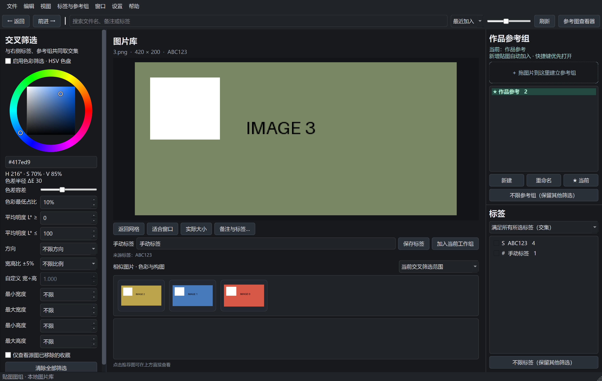
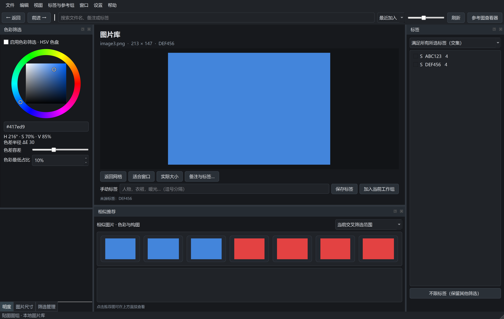
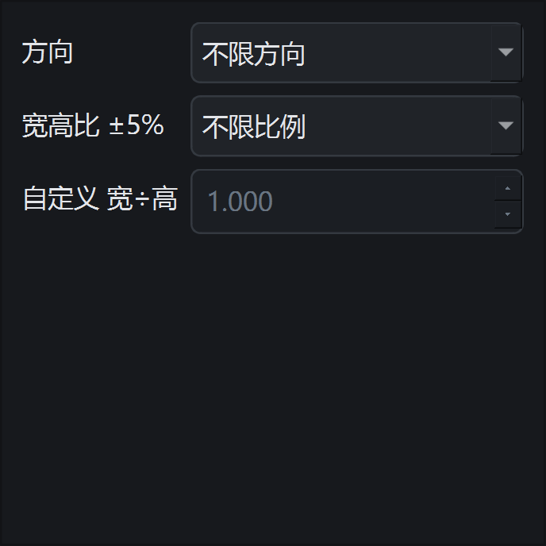
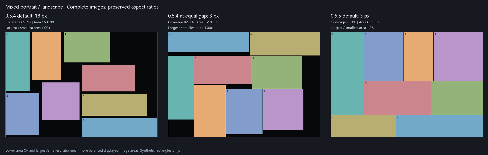

<p align="center"></p>

# SnipBoard

**把零散贴图整理成自己的参考图库。**

Windows 本地图片整理工具，提供图片库和自由参考图画布。支持读取 Snipaste 已保存的贴图、手动导入图片，通过标签、颜色和尺寸寻找素材，再将它们紧凑排列到参考组中。

**当前最新版本：0.6.2 Preview · Windows x64 · 中文界面**

[下载便携版](https://github.com/cjr050127-bit/SnipBoard/releases/tag/v0.6.2) · [使用手册](docs/USER_GUIDE.md) · [更新记录](docs/RELEASE_0_6_2.md) · [问题反馈](https://github.com/cjr050127-bit/SnipBoard/issues)

> SnipBoard 是独立个人项目。Snipaste 是可选来源；不安装 Snipaste 也能导入和整理本地图片。本仓库展示当前完成版本，仍保留 Preview 标识。

## 0.6.2：查看器默认始终置顶

- 参考图查看器默认保持在其他普通窗口上方，切回绘画软件后仍可查看参考图。
- 查看器右击 **始终置顶** 可勾选或取消；查看器获得焦点时按 **Ctrl+Shift+A** 也可切换。
- 手动取消后会记住选择；旧版普通窗口默认设置首次升级时自动改为置顶。
- 修复置顶状态意外丢失后不会恢复的问题；恢复置顶不抢输入焦点，隐藏或最小化的查看器保持原状态。

## 0.6.1：取消单张图片的标签

- 大图下方显示一行图片标签，点击标签右侧 **×** 即可取消；标签较多时可横向滚动。
- 缩略图与推荐图右击 **取消标签 → 标签名称**，仅解除右击图片的该标签关联，即使当前多选也不会修改其他图片。
- 保留图片和标签本身，来源标签的取消仅保存在本地，后续同步不会自动加回；拖回标签即可重新加入。
- 标签筛选、其他图库窗口和参考画布即时刷新。首次打开旧图库会自动备份数据库，再升级到 schema 6。


## 0.6.0：自由组合的面板

拖动面板标题栏，可停靠到窗口四边、与其他面板叠成标签页，或拖出成为浮动窗口。双击标题栏可切换浮动与停靠，拖动面板边界调整尺寸。

在 **窗口** 菜单勾选或取消：当前工作组与参考组、标签、色彩筛选、明度筛选、图片比例筛选、图片尺寸筛选、筛选管理、相似推荐。点面板右上角 × 也可隐藏，之后可从该菜单找回。

- **窗口 → 恢复默认面板布局**：找回全部面板并恢复默认位置，保留筛选条件。
- **Tab**：统一显示／隐藏五个筛选面板。
- 布局随各图库窗口分别保存，正常退出并重启后恢复位置、浮动状态、标签页与显隐；旧版窗口状态自动使用默认面板布局。
- 隐藏面板不会清除筛选、删除标签或停止当前工作组收集；相似推荐可独立拖出与调整大小。

## 产品预览

以下是 0.6.0 实际程序使用合成测试图片的截图，不包含私人图库内容。







## 能做什么

| 功能 | 用法与价值 |
| --- | --- |
| 可停靠面板 | 八个独立面板，浮动、停靠、标签页组合，窗口菜单显示开关及布局恢复 |
| 双界面 | 图片库负责查找整理，参考图画布负责并排观察；可同时打开多个图库窗口 |
| 本地图片导入 | PNG、JPEG、WebP、BMP、TIFF、GIF；复制入库并去重，保留原文件 |
| Snipaste 兼容读取 | 自动发现或手动连接本机来源，读取已保存贴图 PNG，约每 5 秒检查更新 |
| 标签与参考组 | 拖拽归类、Ctrl 多选批量加入；当前工作组自动收集新增贴图 |
| 交叉筛选 | 标签、参考组、搜索词、颜色占比、明度、方向、比例与尺寸组合筛选 |
| 本地相似推荐 | 根据颜色、构图和感知哈希推荐；不使用云端或语义 AI 模型 |
| 自由查看器 | 平移缩放、旋转、撤销重做、保存布局；黑白灰及透明背景 |
| 紧凑排列 | Ctrl+P 根据窗口尺寸重排，每张图片等比缩放、不裁切；默认间距 3 px，可设为 0 |
| 数据维护 | 图库备份、恢复到新图库、完整性检查、重建缩略图与恢复移除内容 |

## 下载与开始使用

1. 打开 [v0.6.2 下载页](https://github.com/cjr050127-bit/SnipBoard/releases/tag/v0.6.2)，下载 **SnipBoard-0.6.2-Windows-x64.zip**。GitHub 自动生成的 `Source code` 是源码，不是可运行便携包。
2. 完整解压至有写入权限的普通文件夹；保留 `SnipBoard.exe` 旁的 `_internal` 文件夹，不要只拖出 EXE。
3. 双击 `SnipBoard.exe`。无需 Python；当前提供 Windows x64 包，建议使用 Windows 10/11 64 位，干净系统兼容性尚待更多实测。应用尚未代码签名；如果系统提示未知发布者，请核对下载来源和校验值。
4. 首次连接会查找 Snipaste，唯一来源自动连接，多来源供选择；也可选择“暂时跳过”，用 **Ctrl+O** 导入本地图片。
5. 拖图片到右侧建立参考组；打开参考图查看器，调整窗口大小后按 **Ctrl+P** 紧凑排列。

SHA-256 校验文件与 ZIP 一起提供。在 PowerShell 中运行 `Get-FileHash .\SnipBoard-0.6.2-Windows-x64.zip -Algorithm SHA256`，与同页 `.sha256` 文件比较。

## 常用操作

| 操作 | 快捷键或入口 |
| --- | --- |
| 导入本地图片 | Ctrl+O |
| 新建独立图库窗口 | Ctrl+N |
| 打开当前工作组查看器 | Ctrl+Alt+B；冲突时用菜单或托盘 |
| 按窗口紧凑排列整个集合 | Ctrl+P |
| 缩放 / 平移画布 | 滚轮 / 空格＋左键或中键拖动 |
| 始终置顶开关 | 查看器右击菜单；查看器获得焦点时 Ctrl+Shift+A |
| 适合窗口 | F |
| 旋转图片 | 拖动图片右下角；Shift 吸附到 15° |
| 调整图片尺寸 | 拖动图片左下角 |
| 退出应用 | 菜单或托盘“退出应用”；关闭窗口仍驻留托盘 |

## 数据、安全与兼容性

- 默认图库位于 `%LOCALAPPDATA%\SnipBoard\library`，图片副本、数据库和布局保存在本机。程序核心代码未实现图片上传或云同步。
- Snipaste 来源只读：不会写回其图片、标签或图组。除 PNG 外，当前实现还读取 `config.ini`、`.sp0` 的图组名称候选及 `splog.txt`；
- 不导入 `.sp1` 截图历史；`.sp2` 仅检查是否存在，未完整解析图组成员。不保证跟随 Snipaste 当前活动组。
- 关闭普通自动同步但保留“当前工作组”时仍会收集新贴图；需要停用时同时取消当前工作组，或完全退出应用。
- 从图库删除图片属于逻辑删除，保留源文件与本地副本。升级前建议“文件 → 备份收藏库”；不要用旧版直接打开升级后的数据库。
- [兼容性与法律风险说明](docs/COMPATIBILITY_AND_LEGAL.md) · [隐私说明](docs/PRIVACY.md) · [第三方依赖](THIRD_PARTY_NOTICES.md)

## 版本与验证范围

0.6.2 将查看器默认设为始终置顶，并增加右击与快捷键开关；0.6.1 新增单图标签取消；0.6.0 将固定侧栏改为八个可停靠面板，并保存各窗口的面板布局。紧凑拼版延续 0.5.5 的算法与默认 3 px 间距。



发布准备期间完整回归 **123 项测试通过**。既有验收覆盖原生隐藏窗口、旋转、布局恢复及高 DPI；真实多显示器动态 DPI、睡眠恢复、万张真实图片性能和干净 Windows 环境仍待实测。详细数据见 [0.6.2 更新记录](docs/RELEASE_0_6_2.md)。

## 从源码运行

要求 Python 3.11+；当前便携版构建环境为 Python 3.14.5、PySide6 6.11.2。

```powershell
git clone https://github.com/cjr050127-bit/SnipBoard.git
cd SnipBoard
python -m venv .venv
.\.venv\Scripts\python.exe -m pip install -r requirements-build.txt
.\run.ps1 desktop
.\test.ps1
.\build.ps1 -InstallPyInstaller
```

构建输出位于 `dist/SnipBoard-0.6.2/`。打包和公开分发还需携带第三方许可及对应库源码，见 [依赖说明](THIRD_PARTY_NOTICES.md)。

## 支持这个个人项目

如果 SnipBoard 帮到了你，欢迎点 Star、分享使用体验，或在 Issues 提交可复现的问题。请不要在公开反馈中附上私人图片、未经清理的数据库或日志。

SnipBoard 是持续维护的免费开源项目。如果它帮你更方便地整理绘画参考，欢迎自愿请作者喝杯咖啡，支持后续维护与改进。无需赞助也能下载和使用，赞助不承诺专属功能或服务。

<details>
<summary>☕ 自愿支持作者（支付宝，点击展开）</summary>

打开支付宝扫一扫，或保存下方收款码后在支付宝中识别。金额自愿，感谢你的支持。

<p align="center">
  
</p>

</details>

## 许可

SnipBoard 自有代码按 [MIT License](LICENSE) 发布，Copyright © 2026 cjr050127-bit。允许保留版权与许可声明后的使用、修改和商用。第三方库及用户导入图片不受本项目 MIT 许可重新授权；Qt/PySide6 等依赖遵循各自条款。
